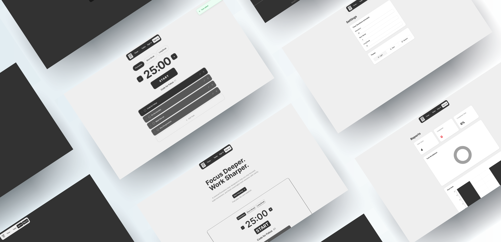

<p align="center">
  
</p>

<h1 align="center">Fokus</h1>

<p align="center">
  <strong>Minimal Pomodoro Timer for Deep Focus</strong>
  <br>
  A clean, fully client-side Pomodoro timer built with Next.js 15, TypeScript, and Tailwind CSS 4 — no backend, no database, just focus.
</p>

<p align="center">
  
  
  
  
  
  
  
  
</p>

---

## About

Fokus is a **production-quality Pomodoro timer** that helps you stay focused, build momentum, and finish meaningful work sessions with clarity. Every feature is designed around the Pomodoro technique — work in focused intervals, track tasks, and review your productivity over time.

Built entirely as a **client-side SPA** with no backend dependency. All data (tasks, settings) persists in `localStorage`. The app features a custom timer engine with three modes (pomodoro, short-break, long-break), a drag-and-drop task manager, interactive charts, and full light/dark/system theme support.

---

## Features

|                                                                                                        |                                                                                                        |                                                                                                    |
| ------------------------------------------------------------------------------------------------------ | ------------------------------------------------------------------------------------------------------ | -------------------------------------------------------------------------------------------------- |
| **⏱️ Pomodoro Engine** — Three-mode timer (pomodoro, short break, long break) with configurable durations persisted to localStorage | **📋 Task Manager** — Add, edit, delete, reorder with @dnd-kit drag-and-drop, swipe-to-delete, auto-focus on add | **📊 Reports Dashboard** — Pie and bar charts via Recharts showing completion rates and daily trends |
| **🎨 Theme System** — Light, dark, and system-aware themes via next-themes with smooth CSS variable transitions | **🔔 Toast Notifications** — sonner-powered success/error toasts with matching Lucide icons across all interactions | **🧾 Form Validation** — react-hook-form with zod v4 schemas for task dialogs and auth forms        |
| **🏠 Landing Page** — Hero section with CTA, showcase screenshot, and responsive layout | **📱 Responsive Design** — Mobile-first layout with adaptive components, sticky footer, and AOS scroll animations | **🗄️ Zero Backend** — Fully client-side, all state in localStorage, no API routes, no server components |

---

## Tech Stack

| Frontend                                           | Infrastructure & Tooling           |
| -------------------------------------------------- | ---------------------------------- |
| **Next.js 15** (App Router, `"use client"` pages)  | **TypeScript** (strict mode)       |
| **Tailwind CSS 4** (`@import "tailwindcss"`)       | **shadcn/ui** (Radix primitives)   |
| **zod 4** (schema validation)                       | **react-hook-form** (forms)        |
| **@dnd-kit** (drag-and-drop)                       | **Recharts** (charts)              |
| **sonner** (toasts)                                | **AOS** (scroll animations)        |
| **Lucide React** (icons)                           | **next-themes** (theme switching)  |
| **clsx + tailwind-merge** (`cn()` utility)         | **ESLint** (linting)               |

---

## Architecture

```
┌────────────────────────────────────────────────────────┐
│                  Next.js App Router (SPA)               │
│                                                         │
│  Pages → Client Components                              │
│    → Custom Hooks (useTimer, useTasks)                  │
│      → localStorage (fokus-tasks, fokus-settings)       │
│        → UI Layer (shadcn/ui + Tailwind CSS 4)          │
│                                                         │
│  ┌──────────┐  ┌──────────┐  ┌──────────┐  ┌────────┐ │
│  │  Timer   │  │  Tasks   │  │ Settings │  │Reports │ │
│  │  Engine  │  │  (DnD)   │  │(Themes + │  │Charts  │ │
│  │3 modes   │  │CRUD+sort │  │Durations)│  │Recharts│ │
│  └──────────┘  └──────────┘  └──────────┘  └────────┘ │
│                                                         │
│  ┌────────────────────────────────────────────────┐     │
│  │           Shared Infrastructure                 │     │
│  │  Navbar │ Footer │ AOS Provider │ ThemeProvider │     │
│  │  TooltipProvider │ Toaster (sonner)             │     │
│  └────────────────────────────────────────────────┘     │
└────────────────────────────────────────────────────────┘
```

The app is a **pure client-side SPA**. All pages use `"use client"` — no server components, no API routes, no server actions. The timer engine and task hooks manage state locally and persist to `localStorage`. The theme system uses `next-themes` with a `class` strategy, toggling the `.dark` class on `<html>`. Scroll animations are handled by AOS with `once: true`.

---

## Routes

| Route       | Page                  |
| ----------- | --------------------- |
| `/`         | Landing page          |
| `/timer`    | Pomodoro timer        |
| `/tasks`    | Task manager          |
| `/settings` | Timer + theme config  |
| `/reports`  | Productivity charts   |
| `/login`    | Sign-in form          |
| `/register` | Create account        |

---

## Getting Started

### Prerequisites

- Node.js 20+
- npm

### Quick Setup

```bash
# Clone the repository
git clone <repo-url>
cd fokus

# Install dependencies
npm install

# Start the dev server
npm run dev
```

<details>
<summary>Available commands</summary>

| Command             | Description                        |
| ------------------- | ---------------------------------- |
| `npm run dev`       | Start development server           |
| `npm run build`     | Production build (also typechecks) |
| `npm run lint`      | Run ESLint                         |

</details>

Open [http://localhost:3000](http://localhost:3000) in your browser.

---

## Project Structure

```
app/
├── login/          # Login page
├── register/       # Registration page
├── reports/        # Reports & charts
├── settings/       # Timer durations & theme
├── tasks/          # Task manager
├── timer/          # Pomodoro timer
├── globals.css     # Theme CSS variables
└── layout.tsx      # Root layout (providers, Navbar, Footer)
components/
├── compiled-ui/    # Navbar, Footer
├── timer/          # TaskDialog, SortableTaskItem
├── ui/             # 50+ shadcn/ui Radix primitives
├── aos-provider.tsx
└── theme-provider.tsx
hooks/
└── timer/          # useTimer, useTasks, shared types
lib/
└── utils.ts        # cn() utility (clsx + tailwind-merge)
public/
├── images/         # Logo, screenshots
└── favicon.svg     # SVG favicon
```

---

<p align="center">
  <sub>Built with Next.js, TypeScript, and Tailwind CSS — designed for deep focus.</sub>
</p>
